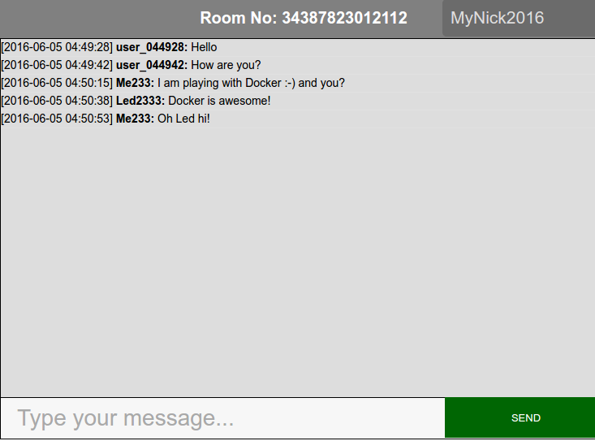

Instant php chat
------------------------------



### About

This is a very simple php chat running with php.

 - Messages are saved on an html file (messages.html). There is no database.
 - Messages are posted with ajax.
 - No cache, either cookies exist.

### Install

Just clone this repo to your ```www``` folder and visit ```www/app/``` path.

This app not for production, use with care!

### Using docker

Ther is an image on docker hub: [tplcom/php-chat](https://hub.docker.com/r/tplcom/php-chat)

```
docker pull tplcom/php-chat
docker run -tid -p 8088:80 tplcom/php-chat
// Open localhost:8088
```

### License

GPL v2, see [LICENSE](LICENSE).
